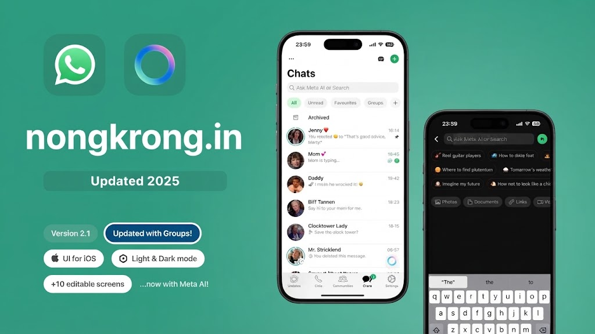

<div align="center">

# Nongkrong.in ☕💬

  <p>A scalable, lightweight real-time communication platform engineered from scratch using vanilla web technologies and Node.js, featuring an intuitive iOS-inspired dark-mode interface.</p>

  <p>
    <a href="#-preview">Preview</a> •
    <a href="#-key-features">Features</a> •
    <a href="#-tech-stack--tools">Tech Stack</a> •
    <a href="#-project-architecture">Architecture</a> •
    <a href="#-getting-started">Getting Started</a> •
    <a href="#-deployment">Deployment</a>
  </p>

  
  
  
  
  
  
</div>

---

## 📸 Preview

<div align="center">
  
</div>

---

## 🚀 Overview

**Nongkrong.in** is a production-ready real-time chat web application designed for seamless cross-platform messaging. Built without heavy frontend frameworks, this project leverages pure **HTML5, CSS3, and Vanilla JavaScript (ES6+)** paired with a robust **Node.js** backend. It eliminates native build roadblocks while delivering enterprise-grade features such as persistent session authentication, dynamic user discovery, and bi-directional event synchronization via **Socket.io**.

---

## ✨ Key Features

* **Secure Authentication Pipeline:** Credential management backed by `bcrypt` password hashing and session-based authorization handlers.
* **Relationship Lifecycle Engine:** Dynamic peer discovery via username queries coupled with a robust friend-request workflow (Send, Accept, Reject).
* **Low-Latency Messaging:** Bidirectional real-time event streaming restricted strictly to verified peer relationships.
* **Presence & Activity Telemetry:** Live tracking for online/offline states paired with real-time "typing..." event triggers.
* **Atomic JSON Persistence:** Optimized custom JSON file-database model (`data/db.json`) ensuring zero-friction setup without C++ compiler dependencies.
* **Responsive Layout System:** Minimalist dark-mode UI engineered for high-density readability across desktop and mobile viewports.

---

## 🛠️ Tech Stack & Development Tools

| Layer | Technology / Tool | Description |
| :--- | :--- | :--- |
| **Frontend** | HTML5, CSS3, Vanilla JavaScript (ES6+) | Modern semantic markup, custom CSS design tokens, and reactive DOM controllers. |
| **Backend** | Node.js, Express.js, Socket.io | Asynchronous event-driven server architecture and real-time socket communication. |
| **Persistence** | File-based JSON Database | Transactional file storage abstraction layer (`database.js`). |
| **IDE / Editor** | Visual Studio Code (VS Code) | Primary development, debugging, and workspace orchestration environment. |

---

## 📂 Project Architecture

```text
realtime-chat/
├── server.js               # Application entry point (Express & Socket.io initialization)
├── database.js             # Data-access layer (JSON persistence abstraction)
├── data/                   
│   └── db.json             # Automated transactional database store
├── Photo/                  
│   └── nongkrong.jpg       # Application screenshot / preview asset
├── package.json            # Project manifests and dependency trees
└── public/                 # Client-side static assets
    ├── login.html          # Authentication view (HTML5)
    ├── register.html       # Account onboarding view (HTML5)
    ├── chat.html           # Core messaging client workspace (HTML5)
    ├── css/                
    │   └── style.css       # Design system tokens and styling rules (CSS3)
    └── js/                 
        └── chat.js         # Socket event bindings and DOM controllers (Vanilla JS)
